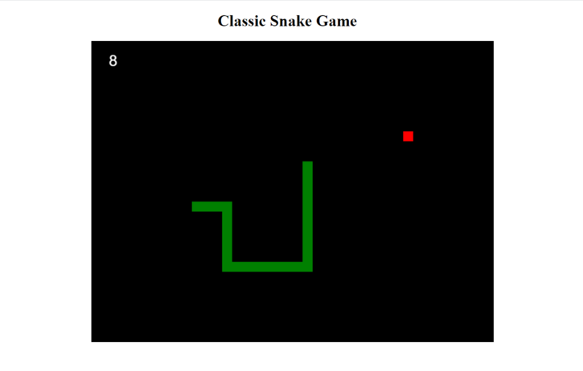

# snake-game

*Classic Snake game written with pure Javascript, HTML, and CSS*

Play it by followng this link: https://johnladeur.github.io/snake-game/

## Summary

This is my version of the classic snake game in which players direct a green snake character on the screen towards an apple that serves as the objective.  The application was made using HTML, CSS, and Javascript. Each time the apple is "eaten" by the snake, the length of the snake will increase incrementally by one segment.  This version is congruent in its functionality with what has become the standard way to play "Snake" on a computer. 

**Directions**

The player uses the arrow keys on the keyboard to move the snake in the corresponding direction.  A point is scored each time the head of the snake reaches the location of the red "apple." The player must avoid allowing the head of the snake to come into contact with any of the four boundaries that make up the perimeter of the game canvas, or the game ends.  The game also ends if the snake comes into contact with any part of itself.

## Author

John LaDeur - Software Developer

Email: <jdladeur@gmail.com>  
LinkedIn: https://www.linkedin.com/in/john-ladeur-92833a54/
